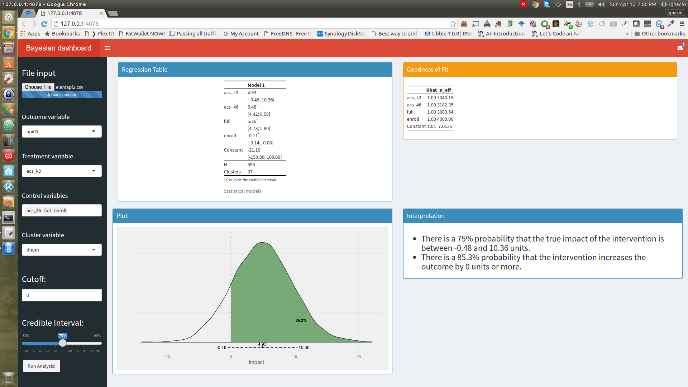

---
output:
  md_document:
    variant: markdown_github
---

<!-- README.md is generated from README.Rmd. Please edit that file -->

```{r, echo = FALSE}
knitr::opts_chunk$set(
  collapse = TRUE,
  comment = "#>",
  fig.path = "README-"
)
```

# Why should I use it?

This package makes using STAN easy!

# How do I use it?

## Create some fake data:

```{r}
set.seed(9782)
library(dplyr)
N <- 1000
df1 <- data.frame(
  x1 = rnorm(n = N, mean = 10, sd = 3),
  x2 = runif(n = N, min = 0, max = 10),
  c = sample(LETTERS, size = N, replace = T)
  ) %>% mutate(Tr = ifelse(c %in% c("A","E","I","O","U"), yes = 1, no = 0)) %>%
  mutate(y = 0.5*x1 + 0.75*x2 + 0.5*Tr + rnorm(N,0,1))

```

## Run stan lm

```{r}
library(easybayesian)
library(rstan)
lm1 <- stanlm(formula = y ~ x1 + x2 + Tr, data = df1)

```

### Regression table

```{r results='asis'}
regtbl(lm1, type = "html", caption = "")
```

### Goodness of fit
```{r results='asis'}
gof.table(lm1, caption = "My caption!", type="html")

```

### Plot

```{r, fig.height=8, fig.width=12}
p <- posteriorplot(model = lm1, parameter = "Tr", cutoff = 0.4, credibleIntervalWidth = .95)
```

### Interpret

```{r}
interpret(model = lm1, name = "Tr", cutoff = 0)
```


## Clustered

```{r}
lm1 <- stanlm(formula = y ~ x1 + x2 + Tr, cluster = "c", data = df1)
```

### Regression table

```{r results='asis'}
regtbl(lm1, type = "html", caption = "")
```

### Goodness of fit
```{r results='asis'}
gof.table(lm1, caption = "My caption!", type="html")

```

### Plot

```{r, fig.height=8, fig.width=12}
p <- posteriorplot(model = lm1, parameter = "Tr", cutoff = 0.4, credibleIntervalWidth = .95)
```

### Interpret

```{r}
interpret(model = lm1, name = "Tr", cutoff = 0)
```

# Dashboard

```
bayesiandashboard()
```




# How do I get it?

For now, this package is not public. But if you are here, I probably want to share it with you.

To install the package you can run `devtools::install_github(repo = 'ignacio82/easybayesian', auth_token = '40748ac7538e4b47244a58cf9b1479d48e7bd531')`
