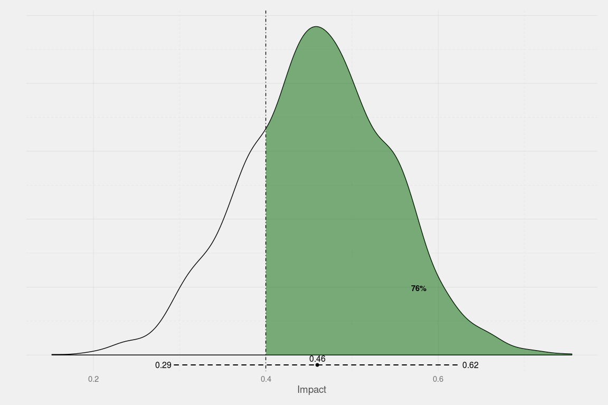

<!-- README.md is generated from README.Rmd. Please edit that file -->
Why should I use it?
====================

This package makes using STAN easy!

How do I use it?
================

Create some fake data:
----------------------

``` r
library(dplyr)
#> 
#> Attaching package: 'dplyr'
#> The following objects are masked from 'package:stats':
#> 
#>     filter, lag
#> The following objects are masked from 'package:base':
#> 
#>     intersect, setdiff, setequal, union
N <- 1000
df1 <- data.frame(
  x1 = rnorm(n = N, mean = 10, sd = 3),
  x2 = runif(n = N, min = 0, max = 10),
  c = sample(LETTERS, size = N, replace = T)
  ) %>% mutate(Tr = ifelse(c %in% c("A","E","I","O","U"), yes = 1, no = 0)) %>%
  mutate(y = 0.5*x1 + 0.75*x2 + 0.5*Tr + rnorm(N,0,1))
```

Run stan lm
-----------

``` r
library(lmstan)
library(rstan)
#> Loading required package: ggplot2
#> rstan (Version 2.9.0-3, packaged: 2016-02-11 15:54:41 UTC, GitRev: 05c3d0058b6a)
#> For execution on a local, multicore CPU with excess RAM we recommend calling
#> rstan_options(auto_write = TRUE)
#> options(mc.cores = parallel::detectCores())
lm1 <- stanlm(formula = y ~ x1 + x2 + Tr, data = df1)
```

### Regression table

``` r
regtbl(lm1, type = "html", caption = "")
```

<!DOCTYPE HTML PUBLIC "-//W3C//DTD HTML 4.01 Transitional//EN" "http://www.w3.org/TR/html4/loose.dtd">
<table cellspacing="0" align="center" style="border: none;">
<tr>
<th style="text-align: left; border-top: 2px solid black; border-bottom: 1px solid black; padding-right: 12px;">
<b></b>
</th>
<th style="text-align: left; border-top: 2px solid black; border-bottom: 1px solid black; padding-right: 12px;">
<b>Model 1</b>
</th>
</tr>
<tr>
<td style="padding-right: 12px; border: none;">
x1
</td>
<td style="padding-right: 12px; border: none;">
0.52<sup style="vertical-align: 0px;">\*</sup>
</td>
</tr>
<tr>
<td style="padding-right: 12px; border: none;">
</td>
<td style="padding-right: 12px; border: none;">
\[0.50; 0.54\]
</td>
</tr>
<tr>
<td style="padding-right: 12px; border: none;">
x2
</td>
<td style="padding-right: 12px; border: none;">
0.75<sup style="vertical-align: 0px;">\*</sup>
</td>
</tr>
<tr>
<td style="padding-right: 12px; border: none;">
</td>
<td style="padding-right: 12px; border: none;">
\[0.73; 0.77\]
</td>
</tr>
<tr>
<td style="padding-right: 12px; border: none;">
Tr
</td>
<td style="padding-right: 12px; border: none;">
0.47<sup style="vertical-align: 0px;">\*</sup>
</td>
</tr>
<tr>
<td style="padding-right: 12px; border: none;">
</td>
<td style="padding-right: 12px; border: none;">
\[0.32; 0.63\]
</td>
</tr>
<tr>
<td style="padding-right: 12px; border: none;">
Constant
</td>
<td style="padding-right: 12px; border: none;">
-0.20
</td>
</tr>
<tr>
<td style="padding-right: 12px; border: none;">
</td>
<td style="padding-right: 12px; border: none;">
\[-0.43; 0.04\]
</td>
</tr>
<tr>
<td style="border-top: 1px solid black;">
N
</td>
<td style="border-top: 1px solid black;">
1000
</td>
</tr>
<tr>
<td style="padding-right: 12px; border: none;" colspan="3">
<span style="font-size:0.8em">\* 0 outside the credible interval.</span>
</td>
</tr>
</table>
### Goodness of fit

``` r
gof.table(lm1, caption = "My caption!")
```

<table style="width:50%;">
<caption>My caption!</caption>
<colgroup>
<col width="23%" />
<col width="12%" />
<col width="13%" />
</colgroup>
<thead>
<tr class="header">
<th align="left"> </th>
<th align="left">Rhat</th>
<th align="left">n_eff</th>
</tr>
</thead>
<tbody>
<tr class="odd">
<td align="left"><pre><code>**x1**</code></pre></td>
<td align="left"><p>0.9999</p></td>
<td align="left"><p>3506</p></td>
</tr>
<tr class="even">
<td align="left"><pre><code>**x2**</code></pre></td>
<td align="left"><p>1</p></td>
<td align="left"><p>3237</p></td>
</tr>
<tr class="odd">
<td align="left"><pre><code>**Tr**</code></pre></td>
<td align="left"><p>1</p></td>
<td align="left"><p>3322</p></td>
</tr>
<tr class="even">
<td align="left"><p><strong>Constant</strong></p></td>
<td align="left"><p>1</p></td>
<td align="left"><p>2894</p></td>
</tr>
</tbody>
</table>

### Plot

``` r
posteriorplot(model = lm1, parameter = Tr, cutoff = 0.4)
```

<!-- -->

Clustered
---------

``` r
lm1 <- stanlm(formula = y ~ x1 + x2 + Tr, cluster = c, data = df1)
```

### Regression table

``` r
regtbl(lm1, type = "html", caption = "")
```

<!DOCTYPE HTML PUBLIC "-//W3C//DTD HTML 4.01 Transitional//EN" "http://www.w3.org/TR/html4/loose.dtd">
<table cellspacing="0" align="center" style="border: none;">
<tr>
<th style="text-align: left; border-top: 2px solid black; border-bottom: 1px solid black; padding-right: 12px;">
<b></b>
</th>
<th style="text-align: left; border-top: 2px solid black; border-bottom: 1px solid black; padding-right: 12px;">
<b>Model 1</b>
</th>
</tr>
<tr>
<td style="padding-right: 12px; border: none;">
x1
</td>
<td style="padding-right: 12px; border: none;">
0.52<sup style="vertical-align: 0px;">\*</sup>
</td>
</tr>
<tr>
<td style="padding-right: 12px; border: none;">
</td>
<td style="padding-right: 12px; border: none;">
\[0.50; 0.54\]
</td>
</tr>
<tr>
<td style="padding-right: 12px; border: none;">
x2
</td>
<td style="padding-right: 12px; border: none;">
0.75<sup style="vertical-align: 0px;">\*</sup>
</td>
</tr>
<tr>
<td style="padding-right: 12px; border: none;">
</td>
<td style="padding-right: 12px; border: none;">
\[0.73; 0.77\]
</td>
</tr>
<tr>
<td style="padding-right: 12px; border: none;">
Tr
</td>
<td style="padding-right: 12px; border: none;">
0.48<sup style="vertical-align: 0px;">\*</sup>
</td>
</tr>
<tr>
<td style="padding-right: 12px; border: none;">
</td>
<td style="padding-right: 12px; border: none;">
\[0.30; 0.65\]
</td>
</tr>
<tr>
<td style="padding-right: 12px; border: none;">
Constant
</td>
<td style="padding-right: 12px; border: none;">
-0.20
</td>
</tr>
<tr>
<td style="padding-right: 12px; border: none;">
</td>
<td style="padding-right: 12px; border: none;">
\[-0.44; 0.05\]
</td>
</tr>
<tr>
<td style="border-top: 1px solid black;">
N
</td>
<td style="border-top: 1px solid black;">
1000
</td>
</tr>
<tr>
<td style="border-bottom: 2px solid black;">
Clusters
</td>
<td style="border-bottom: 2px solid black;">
26
</td>
</tr>
<tr>
<td style="padding-right: 12px; border: none;" colspan="3">
<span style="font-size:0.8em">\* 0 outside the credible interval.</span>
</td>
</tr>
</table>
### Goodness of fit

``` r
gof.table(lm1, caption = "My caption!")
```

<table style="width:50%;">
<caption>My caption!</caption>
<colgroup>
<col width="23%" />
<col width="12%" />
<col width="13%" />
</colgroup>
<thead>
<tr class="header">
<th align="left"> </th>
<th align="left">Rhat</th>
<th align="left">n_eff</th>
</tr>
</thead>
<tbody>
<tr class="odd">
<td align="left"><pre><code>**x1**</code></pre></td>
<td align="left"><p>1</p></td>
<td align="left"><p>4000</p></td>
</tr>
<tr class="even">
<td align="left"><pre><code>**x2**</code></pre></td>
<td align="left"><p>1</p></td>
<td align="left"><p>4000</p></td>
</tr>
<tr class="odd">
<td align="left"><pre><code>**Tr**</code></pre></td>
<td align="left"><p>0.9999</p></td>
<td align="left"><p>3056</p></td>
</tr>
<tr class="even">
<td align="left"><p><strong>Constant</strong></p></td>
<td align="left"><p>0.9995</p></td>
<td align="left"><p>3086</p></td>
</tr>
</tbody>
</table>

### Plot

``` r
posteriorplot(model = lm1, parameter = Tr, cutoff = 0.4)
```

<!-- -->

How do I get it?
================

For now, this package is not public. But if you are here, I probably want to share it with you.

To install the package you can run `devtools::install_github(repo = 'ignacio82/lmstan', auth_token = '40748ac7538e4b47244a58cf9b1479d48e7bd531')`
