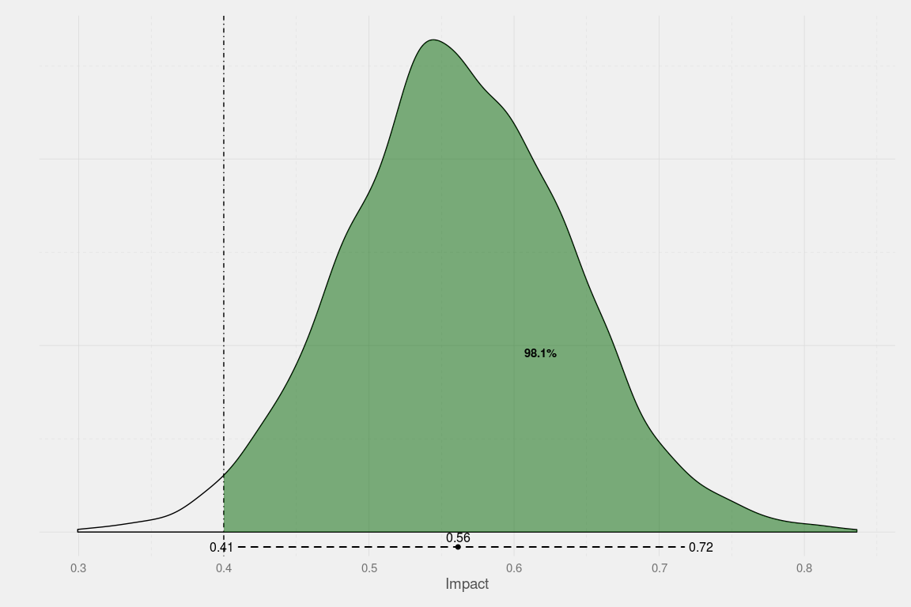
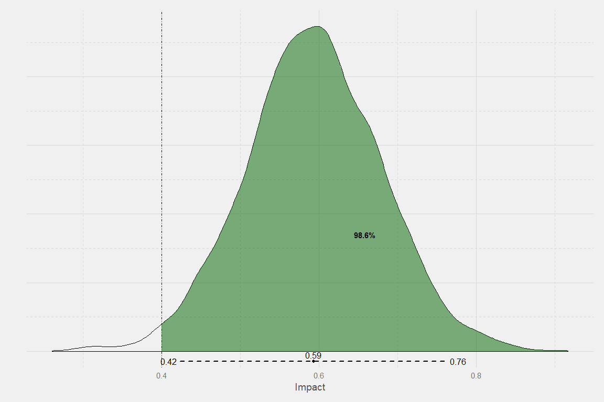

<!-- README.md is generated from README.Rmd. Please edit that file -->
Why should I use it?
====================

This package makes using STAN easy!

How do I use it?
================

Create some fake data:
----------------------

``` r
set.seed(9782)
library(dplyr)
#> 
#> Attaching package: 'dplyr'
#> The following objects are masked from 'package:stats':
#> 
#>     filter, lag
#> The following objects are masked from 'package:base':
#> 
#>     intersect, setdiff, setequal, union
N <- 1000
df1 <- data.frame(
  x1 = rnorm(n = N, mean = 10, sd = 3),
  x2 = runif(n = N, min = 0, max = 10),
  c = sample(LETTERS, size = N, replace = T)
  ) %>% mutate(Tr = ifelse(c %in% c("A","E","I","O","U"), yes = 1, no = 0)) %>%
  mutate(y = 0.5*x1 + 0.75*x2 + 0.5*Tr + rnorm(N,0,1))
```

Run stan lm
-----------

``` r
library(easybayesian)
#> Warning: replacing previous import 'readr::col_numeric' by
#> 'scales::col_numeric' when loading 'easybayesian'
#> Warning: replacing previous import 'readr::col_factor' by
#> 'scales::col_factor' when loading 'easybayesian'
#> Warning: replacing previous import 'shiny::runExample' by
#> 'shinyjs::runExample' when loading 'easybayesian'
#> Warning: replacing previous import 'rstan::show' by 'shinyjs::show' when
#> loading 'easybayesian'
library(rstan)
#> Loading required package: ggplot2
#> rstan (Version 2.9.0-3, packaged: 2016-02-11 15:54:41 UTC, GitRev: 05c3d0058b6a)
#> For execution on a local, multicore CPU with excess RAM we recommend calling
#> rstan_options(auto_write = TRUE)
#> options(mc.cores = parallel::detectCores())
lm1 <- stanlm(formula = y ~ x1 + x2 + Tr, data = df1)
```

### Regression table

``` r
regtbl(lm1, type = "html", caption = "")
```

<!DOCTYPE HTML PUBLIC "-//W3C//DTD HTML 4.01 Transitional//EN" "http://www.w3.org/TR/html4/loose.dtd">
<table cellspacing="0" align="center" style="border: none;">
<tr>
<th style="text-align: left; border-top: 2px solid black; border-bottom: 1px solid black; padding-right: 12px;">
<b></b>
</th>
<th style="text-align: left; border-top: 2px solid black; border-bottom: 1px solid black; padding-right: 12px;">
<b>Model 1</b>
</th>
</tr>
<tr>
<td style="padding-right: 12px; border: none;">
x1
</td>
<td style="padding-right: 12px; border: none;">
0.50<sup style="vertical-align: 0px;">&\#42</sup>
</td>
</tr>
<tr>
<td style="padding-right: 12px; border: none;">
</td>
<td style="padding-right: 12px; border: none;">
\[0.48; 0.52\]
</td>
</tr>
<tr>
<td style="padding-right: 12px; border: none;">
x2
</td>
<td style="padding-right: 12px; border: none;">
0.76<sup style="vertical-align: 0px;">&\#42</sup>
</td>
</tr>
<tr>
<td style="padding-right: 12px; border: none;">
</td>
<td style="padding-right: 12px; border: none;">
\[0.73; 0.78\]
</td>
</tr>
<tr>
<td style="padding-right: 12px; border: none;">
Tr
</td>
<td style="padding-right: 12px; border: none;">
0.59<sup style="vertical-align: 0px;">&\#42</sup>
</td>
</tr>
<tr>
<td style="padding-right: 12px; border: none;">
</td>
<td style="padding-right: 12px; border: none;">
\[0.43; 0.76\]
</td>
</tr>
<tr>
<td style="padding-right: 12px; border: none;">
Constant
</td>
<td style="padding-right: 12px; border: none;">
-0.11
</td>
</tr>
<tr>
<td style="padding-right: 12px; border: none;">
</td>
<td style="padding-right: 12px; border: none;">
\[-0.34; 0.12\]
</td>
</tr>
<tr>
<td style="border-top: 1px solid black;">
N
</td>
<td style="border-top: 1px solid black;">
1000
</td>
</tr>
<tr>
<td style="padding-right: 12px; border: none;" colspan="3">
<span style="font-size:0.8em">&\#42 0 outside the credible interval.</span>
</td>
</tr>
</table>
### Goodness of fit

``` r
gof.table(lm1, caption = "My caption!")
```

<table style="width:50%;">
<caption>My caption!</caption>
<colgroup>
<col width="23%" />
<col width="12%" />
<col width="13%" />
</colgroup>
<thead>
<tr class="header">
<th align="left"> </th>
<th align="left">Rhat</th>
<th align="left">n_eff</th>
</tr>
</thead>
<tbody>
<tr class="odd">
<td align="left"><pre><code>**x1**</code></pre></td>
<td align="left"><p>1.001</p></td>
<td align="left"><p>2859</p></td>
</tr>
<tr class="even">
<td align="left"><pre><code>**x2**</code></pre></td>
<td align="left"><p>1</p></td>
<td align="left"><p>2987</p></td>
</tr>
<tr class="odd">
<td align="left"><pre><code>**Tr**</code></pre></td>
<td align="left"><p>1</p></td>
<td align="left"><p>2960</p></td>
</tr>
<tr class="even">
<td align="left"><p><strong>Constant</strong></p></td>
<td align="left"><p>0.9997</p></td>
<td align="left"><p>3057</p></td>
</tr>
</tbody>
</table>

### Plot

``` r
p <- posteriorplot(model = lm1, parameter = "Tr", cutoff = 0.4, credibleIntervalWidth = .95)
```

<!-- -->

### Interpret

``` r
interpret(model = lm1, name = "Tr", cutoff = 0)
#> [[1]]
#> [1] "There is a 95% probability that the true impact of the intervention is between 0.43 and 0.76 units."
#> 
#> [[2]]
#> [1] "There is a 100% probability that the intervention increases the outcome by 0 units or more."
```

Clustered
---------

``` r
lm1 <- stanlm(formula = y ~ x1 + x2 + Tr, cluster = "c", data = df1)
```

### Regression table

``` r
regtbl(lm1, type = "html", caption = "")
```

<!DOCTYPE HTML PUBLIC "-//W3C//DTD HTML 4.01 Transitional//EN" "http://www.w3.org/TR/html4/loose.dtd">
<table cellspacing="0" align="center" style="border: none;">
<tr>
<th style="text-align: left; border-top: 2px solid black; border-bottom: 1px solid black; padding-right: 12px;">
<b></b>
</th>
<th style="text-align: left; border-top: 2px solid black; border-bottom: 1px solid black; padding-right: 12px;">
<b>Model 1</b>
</th>
</tr>
<tr>
<td style="padding-right: 12px; border: none;">
x1
</td>
<td style="padding-right: 12px; border: none;">
0.50<sup style="vertical-align: 0px;">&\#42</sup>
</td>
</tr>
<tr>
<td style="padding-right: 12px; border: none;">
</td>
<td style="padding-right: 12px; border: none;">
\[0.48; 0.52\]
</td>
</tr>
<tr>
<td style="padding-right: 12px; border: none;">
x2
</td>
<td style="padding-right: 12px; border: none;">
0.76<sup style="vertical-align: 0px;">&\#42</sup>
</td>
</tr>
<tr>
<td style="padding-right: 12px; border: none;">
</td>
<td style="padding-right: 12px; border: none;">
\[0.73; 0.78\]
</td>
</tr>
<tr>
<td style="padding-right: 12px; border: none;">
Tr
</td>
<td style="padding-right: 12px; border: none;">
0.60<sup style="vertical-align: 0px;">&\#42</sup>
</td>
</tr>
<tr>
<td style="padding-right: 12px; border: none;">
</td>
<td style="padding-right: 12px; border: none;">
\[0.42; 0.76\]
</td>
</tr>
<tr>
<td style="padding-right: 12px; border: none;">
Constant
</td>
<td style="padding-right: 12px; border: none;">
-0.11
</td>
</tr>
<tr>
<td style="padding-right: 12px; border: none;">
</td>
<td style="padding-right: 12px; border: none;">
\[-0.34; 0.13\]
</td>
</tr>
<tr>
<td style="border-top: 1px solid black;">
N
</td>
<td style="border-top: 1px solid black;">
1000
</td>
</tr>
<tr>
<td style="border-bottom: 2px solid black;">
Clusters
</td>
<td style="border-bottom: 2px solid black;">
26
</td>
</tr>
<tr>
<td style="padding-right: 12px; border: none;" colspan="3">
<span style="font-size:0.8em">&\#42 0 outside the credible interval.</span>
</td>
</tr>
</table>
### Goodness of fit

``` r
gof.table(lm1, caption = "My caption!")
```

<table style="width:50%;">
<caption>My caption!</caption>
<colgroup>
<col width="23%" />
<col width="12%" />
<col width="13%" />
</colgroup>
<thead>
<tr class="header">
<th align="left"> </th>
<th align="left">Rhat</th>
<th align="left">n_eff</th>
</tr>
</thead>
<tbody>
<tr class="odd">
<td align="left"><pre><code>**x1**</code></pre></td>
<td align="left"><p>0.9999</p></td>
<td align="left"><p>4000</p></td>
</tr>
<tr class="even">
<td align="left"><pre><code>**x2**</code></pre></td>
<td align="left"><p>1</p></td>
<td align="left"><p>4000</p></td>
</tr>
<tr class="odd">
<td align="left"><pre><code>**Tr**</code></pre></td>
<td align="left"><p>0.9999</p></td>
<td align="left"><p>4000</p></td>
</tr>
<tr class="even">
<td align="left"><p><strong>Constant</strong></p></td>
<td align="left"><p>1</p></td>
<td align="left"><p>4000</p></td>
</tr>
</tbody>
</table>

### Plot

``` r
p <- posteriorplot(model = lm1, parameter = "Tr", cutoff = 0.4, credibleIntervalWidth = .95)
```

<!-- -->

### Interpret

``` r
interpret(model = lm1, name = "Tr", cutoff = 0)
#> [[1]]
#> [1] "There is a 95% probability that the true impact of the intervention is between 0.42 and 0.76 units."
#> 
#> [[2]]
#> [1] "There is a 100% probability that the intervention increases the outcome by 0 units or more."
```

Dashboard
=========

    bayesiandashboard()


How do I get it?
================

For now, this package is not public. But if you are here, I probably want to share it with you.

To install the package you can run `devtools::install_github(repo = 'ignacio82/easybayesian', auth_token = '40748ac7538e4b47244a58cf9b1479d48e7bd531')`
